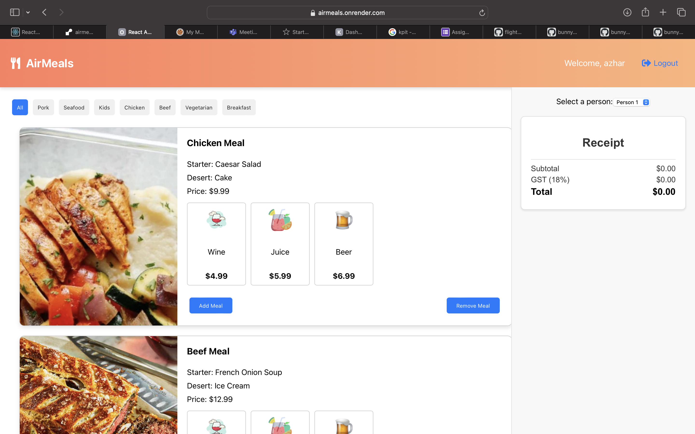

# AirMeals

[Visit AirMeals](https://airmeals.onrender.com)

## Overview

AirMeals is a comprehensive flight menu food ordering system designed to enhance the in-flight dining experience. Passengers can browse through a variety of meal options, select their preferred drinks, and place orders seamlessly. The system is built with a modern frontend and a robust backend, ensuring a smooth and efficient user experience.

## Features

- **Meal Selection**: Browse through a variety of meal options with detailed descriptions and images.
- **Drink Selector**: Choose from a range of drinks to complement your meal.
- **User Authentication**: Secure login and guest login options.
- **Order Management**: Add and remove meals from your order with ease.
- **Responsive Design**: Optimized for both desktop and mobile devices.

## Frontend

The frontend of AirMeals is built using **React**. It leverages modern React hooks and state management to provide a dynamic and responsive user interface. Key components include:

- **MealCard**: Displays meal details and allows users to add or remove meals.
- **DrinkSelector**: Enables users to select drinks for their meals.
- **Navbar**: Provides navigation and displays user information.

### Technologies Used

- React
- Redux (for state management)
- React Router (for navigation)
- CSS Modules (for styling)
- React Icons (for icons)

## Backend

The backend of AirMeals is powered by **Express.js** and is deployed on **Render**. It provides RESTful API endpoints for meal data and user authentication. Key features include:

- **API Endpoints**: Serve meal data and handle user login.
- **Data Management**: Manages meal and user data efficiently.
- **Security**: Implements basic authentication mechanisms.

### Technologies Used

- Node.js
- Express.js
- JSON (for data storage)

## Deployment

The entire application is deployed on **Render**, ensuring high availability and scalability. The frontend and backend are both hosted on Render, providing a seamless integration and deployment process.

## Getting Started

To get started with AirMeals, visit the [deployed application](https://airmeals.onrender.com) and explore the features. You can log in with the provided guest credentials or create a new account to experience the full functionality.

## Screenshot

## Contributing

We welcome contributions to improve AirMeals. Please fork the repository and submit pull requests with your enhancements.

## License

This project is licensed under the MIT License. See the [LICENSE](LICENSE) file for details.

---

Thank you for using AirMeals! We hope you enjoy your in-flight dining experience.
